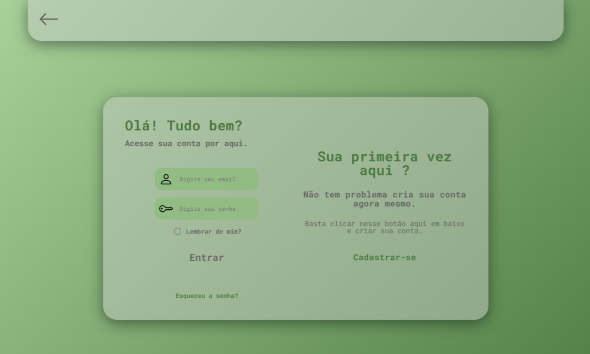

 

# login_page-webpage

> Projeto de uma tela de login desenvolvida utilizando apenas HTML e CSS puro, sem o uso de frameworks, com a adição de JavaScript para implementar funcionalidades que trazem mais dinamismo à página.

## Tecnologias

  
  
  

## Contribuir

1. **Clonar projeto:**: `git clone https://github.com/guicarbar/login_page-webpage.git`
2. **Criar feature/branch:**: `git checkout -b feature/Nome-da-branch`

## Licença

Este projeto está sob a licença [MIT](LICENSE) License.